# banner

> the thing at the top of my profile is one svg file. no javascript, no gifs, no video.

## the problem

github lets you put an image at the top of your profile readme and that is basically it.
you cannot ship javascript. you cannot load anything external. whatever you want the
banner to do has to already be inside one file, because github serves it through an
`` tag and an svg loaded that way is sealed shut. no scripts run in it, ever.

so everything here is smil and css inside a single 44kb file.

## how it works

one clock. every animation in the file is `dur="14s"`, and each thing that happens is
written as a fraction of that: the beam locks at 0.262, the "i" fires at 0.276, the first
hellfire leaves the pylon at 0.439. change the loop length and the whole story stays in
sync because nothing has its own timeline.

## what i learned

- if you cannot eyeball whether something is correct, write the checker. the collision
  auditor took twenty minutes and found three real overlaps i had already looked at and
  called fine
- deterministic beats random. everything on one clock means i can solve for when two
  things meet instead of hoping
- speed makes motion feel alive, shape does not. same path, varied pace, completely
  different animation
- a cache you did not know about will cost you an hour of "it didn't change"
- read the constraint first. half of what i tried failed because an svg in an `` is
  a much smaller box than an svg in a page
- put the best beat first. if a viewer gives you two seconds, spending them on setup is
  the same as having no best beat at all

